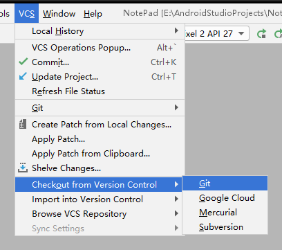
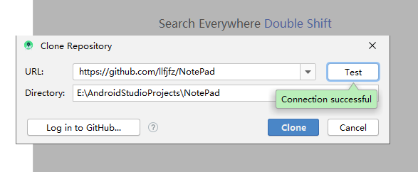
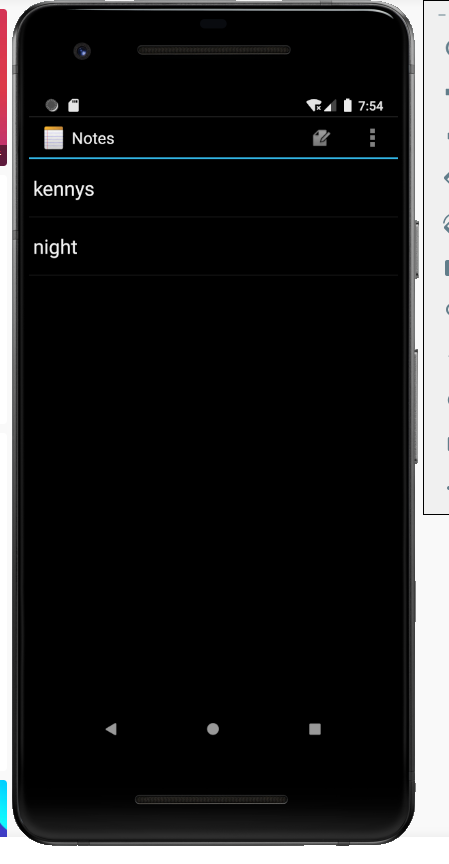
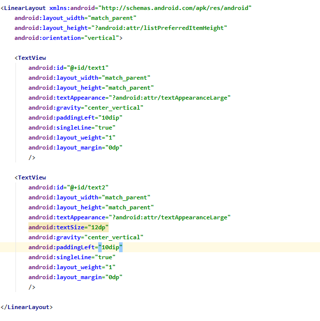
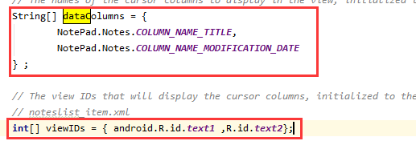
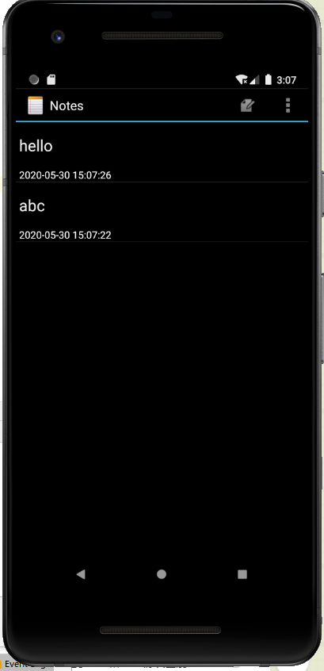
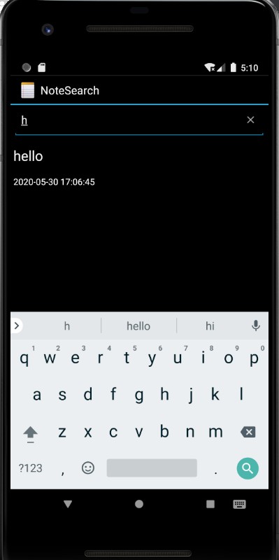
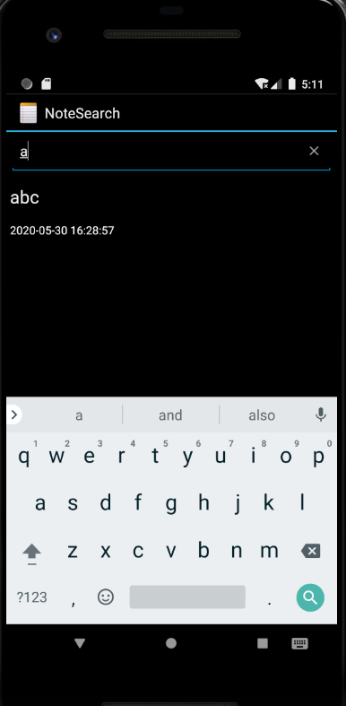

# 期中实验_NotePad笔记本应用

### 克隆notepad项目











## 一、NoteList中显示条目增加时间戳显示

### 1、在NotesList的数据定义中增加修改时间


### 2、在noteslist_item.xml中增加一个用来显示时间的TextView




### 3、Notelist.java中的dataColumns,viewIDs这两个参数加入时间

这里是每个条目创建时的数据




导入包

import java.text.SimpleDateFormat;
import java.util.Date;

然后通过SimpleCursorAdapter来进行装配

```
SimpleCursorAdapter adapter
    = new SimpleCursorAdapter(
              this,    // The Context for the ListView
              R.layout.noteslist_item,     // Points to the XML for a list item
              cursor,        // The cursor to get items from
              dataColumns,
              viewIDs
      );
```


时间就会显示在相应的条目上


运行截图：





## 二、添加笔记查询功能（根据标题查询）

### 1、在list_options_menu.xml中新建一个查询的按钮

```
<item
    android:id="@+id/menu_search"
    android:title="@string/menu_search"
    android:icon="@android:drawable/ic_search_category_default"
    android:showAsAction="always">
</item>
```

### 2、布局搜索页面，在layout中新建布局文件 note_search_list.xml：

```
<?xml version="1.0" encoding="utf-8"?>
<LinearLayout xmlns:android="http://schemas.android.com/apk/res/android"
    android:orientation="vertical" android:layout_width="match_parent"
    android:layout_height="match_parent">
    <SearchView
        android:id="@+id/search_view"
        android:layout_width="match_parent"
        android:layout_height="wrap_content"
        android:iconifiedByDefault="false"
        android:queryHint="输入搜索内容..."
        android:layout_alignParentTop="true">
    </SearchView>
    <ListView
        android:id="@android:id/list"
        android:layout_width="match_parent"
        android:layout_height="wrap_content">
    </ListView>
</LinearLayout>
```


### 3、在NoteList中找到onOptionsItemSelected方法，在switch中添加搜索的case语句:

​    

```
case R.id.menu_search:
    Intent intent = new Intent();
    intent.setClass(NotesList.this,NoteSearch.class);
    NotesList.this.startActivity(intent);
    return true;
```


### 4、对Search的样式做相应的修改

private static final String[] PROJECTION = new String[] {
            NotePad.Notes._ID, // 0
            NotePad.Notes.COLUMN_NAME_TITLE, // 1
            //扩展 显示时间 颜色
            NotePad.Notes.COLUMN_NAME_MODIFICATION_DATE, // 2
            NotePad.Notes.COLUMN_NAME_BACK_COLOR
    };

```
    @Override
    protected void onCreate(Bundle savedInstanceState) {
        super.onCreate(savedInstanceState);
        setContentView(R.layout.note_search_list);
        Intent intent = getIntent();
        if (intent.getData() == null) {
            intent.setData(NotePad.Notes.CONTENT_URI);
        }
        SearchView searchview = (SearchView)findViewById(R.id.search_view);
        //为查询文本框注册监听器
        searchview.setOnQueryTextListener(NoteSearch.this);  
    }
    @Override
    public boolean onQueryTextSubmit(String query) {
        return false;
    }
    @Override
    public boolean onQueryTextChange(String newText) {
        String selection = NotePad.Notes.COLUMN_NAME_TITLE + " Like ? ";
        String[] selectionArgs = { "%"+newText+"%" };
        Cursor cursor = managedQuery(
                getIntent().getData(),            // Use the default content URI for the provider.
                PROJECTION,                       // Return the note ID and title for each note. and modifcation date
                selection,                        // 条件左边
                selectionArgs,                    // 条件右边
                NotePad.Notes.DEFAULT_SORT_ORDER  // Use the default sort order.
        );
        String[] dataColumns = { NotePad.Notes.COLUMN_NAME_TITLE ,  NotePad.Notes.COLUMN_NAME_MODIFICATION_DATE };
        int[] viewIDs = { android.R.id.text1 , R.id.text1_time };
        MyCursorAdapter adapter = new MyCursorAdapter(
                this,
                R.layout.noteslist_item,
                cursor,
                dataColumns,
                viewIDs
        );
        setListAdapter(adapter);
        return true;
    }
    @Override
    protected void onListItemClick(ListView l, View v, int position, long id) {
        // Constructs a new URI from the incoming URI and the row ID
        Uri uri = ContentUris.withAppendedId(getIntent().getData(), id);
        // Gets the action from the incoming Intent
        String action = getIntent().getAction();
        // Handles requests for note data
        if (Intent.ACTION_PICK.equals(action) || Intent.ACTION_GET_CONTENT.equals(action)) {
            // Sets the result to return to the component that called this Activity. The
            // result contains the new URI
            setResult(RESULT_OK, new Intent().setData(uri));
        } else {
            // Sends out an Intent to start an Activity that can handle ACTION_EDIT. The
            // Intent's data is the note ID URI. The effect is to call NoteEdit.
            startActivity(new Intent(Intent.ACTION_EDIT, uri));
        }
    }
}
```

### 5、实现SearchView.OnQueryTextListener接口


### 6、在AndroidManifest.xml注册NoteSearch：

```
<!--添加搜索activity-->
    <activity
        android:name="NoteSearch"
        android:label="@string/title_notes_search">
    </activity>
```

查询结果：








遇到的报错


解决方案：[https://www.jianshu.com/p/550a9c71dcad](https://www.jianshu.com/p/550a9c71dcad)


