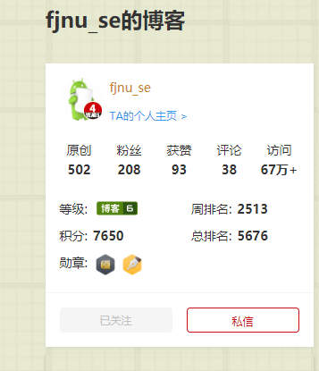
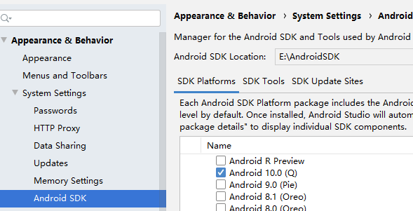
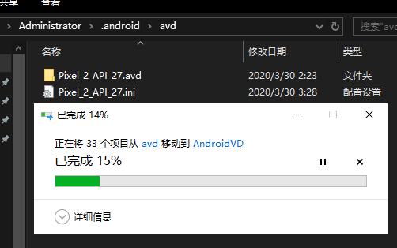
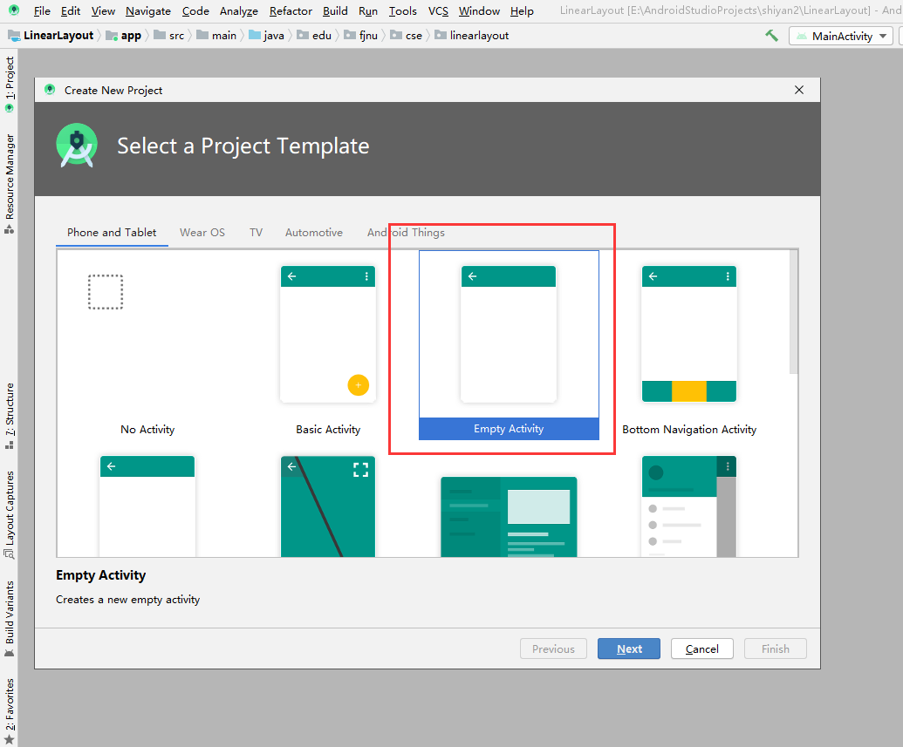
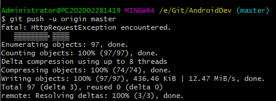

# Android开发基础

## 任务一、关注课程在CSDN上的官方博客，用户名：fjnu_se

## 任务二、创建第一个Android工程并同步GitHub

### 1、安装Android：

### 2、配置SDK路径

### 3、修改AVD存储位置（默认C盘）

把文件夹移出系统盘后修改ini文件路径即可

### 4、创建第一个Android project

## 任务三、同步工程至GitHub

> 添加当前本地仓库下所有文件：
>
> git add .
>
> 确认：
>
>  git commit -m "first commit"
>
> 推送本地仓库：
>
> git push -u origin master

