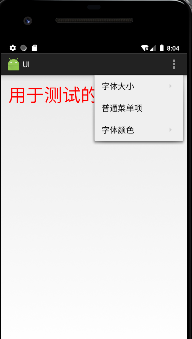

# Android界面布局实验

## 菜单结构：


> 


实现跳转至四个任务


关键代码段：

```
public class MainActivity extends Activity {

    @Override
    protected void onCreate(Bundle savedInstanceState) {
        super.onCreate(savedInstanceState);
        setContentView(R.layout.activity_main);

        Button btn_simpleadapter = (Button)findViewById(R.id.simple_adapter_btn);
        btn_simpleadapter.setOnClickListener(new View.OnClickListener() {
            @Override
            public void onClick(View view) {
                Intent intent = new Intent(MainActivity.this, SimpleAdapte.class);
                startActivity(intent);
            }
        });

        Button btn_custom_dialog = (Button)findViewById(R.id.custom_dialog);
        btn_custom_dialog.setOnClickListener(new View.OnClickListener() {
            @Override
            public void onClick(View view) {
                Intent intent = new Intent(MainActivity.this, CustomDialog.class);
                startActivity(intent);
            }
        });

        Button btn_xml_menu = (Button)findViewById(R.id.xml_menu_btn);
        btn_xml_menu.setOnClickListener(new View.OnClickListener() {
            @Override
            public void onClick(View view) {
                Intent intent = new Intent(MainActivity.this, XmlDefineMenU.class);
                startActivity(intent);
            }
        });

        Button btn_action_context = (Button)findViewById(R.id.action_context_btn);
        btn_action_context.setOnClickListener(new View.OnClickListener() {
            @Override
            public void onClick(View view) {
                Intent intent = new Intent(MainActivity.this, ContextualActionBar.class);
                startActivity(intent);
            }
        });


    }
}
```


## 实验一：Android ListView的用法


创建哈希将头像，名称存于键值对

```
        ArrayList<HashMap<String,String>> arrayList=new ArrayList<>();
        for (int i=0;i<animalName.length;i++)
        {
            HashMap<String,String> hashMap=new HashMap<>();
            hashMap.put("name",animalName[i]);
            hashMap.put("image",animalImages[i]+"");
            arrayList.add(hashMap);
        }
        String[] from={"name","image"};//string array
        int[] to={R.id.textView,R.id.imageView};
```


​        
创建simpleadapter


```
        SimpleAdapter simpleAdapter=new SimpleAdapter(this,arrayList,R.layout.list_view_items,from,to);//Create object and set the parameters for simpleAdapter
        simpleListView.setAdapter(simpleAdapter);//sets the adapter for listView
```

​       

监听事件，Toast 显示 item内容：

​                

```
Toast.makeText(getApplicationContext(),animalName[i],Toast.LENGTH_LONG).show();//show the selected image in toast according to position
```

   


## 实验二：自定义布局的AlertDialog


创建AlertDIalog.builder对象，


```
AlertDialog.Builder builder = new AlertDialog.Builder(this);
        LayoutInflater inflater = getLayoutInflater();
```

父视图作为空值传递动作进入新窗体

```
builder.setView(inflater.inflate(R.layout.custom_dialog, null))
```

设置Cancel 和 Sign in 按钮

```
            .setPositiveButton(R.string.signin, new DialogInterface.OnClickListener() {
                @Override
                public void onClick(DialogInterface dialog, int id) {
                   
                }
            })
            .setNegativeButton(R.string.cancel, new DialogInterface.OnClickListener() {
                public void onClick(DialogInterface dialog, int id) {
                   
                }
            });
```


## 实验三：使用XML定义菜单





重写方法，实现菜单

```
   public boolean onOptionsItemSelected(MenuItem item) {
        switch (item.getItemId()) {
            case R.id.menu_font_small:
                tv_test.setTextSize(10*2);
                break;
            case R.id.menu_font_middle:
                tv_test.setTextSize(16*2);
                break;
            case R.id.menu_font_big:
                tv_test.setTextSize(20*2);
                break;
            case R.id.menu_normal:
                Toast.makeText(XmlDefineMenU.this, "这是普通菜单项", Toast.LENGTH_SHORT).show();
                break;
            case R.id.menu_color_red:
                tv_test.setTextColor(Color.RED);
                break;
            case R.id.menu_color_black:
                tv_test.setTextColor(Color.BLACK);
                break;
        }
        return true;
    }


```


## 实验四：创建上下文操作模式(ActionMode)的上下文菜单


上下文模式

操作模式的显示会覆盖视图顶层操作栏，而不是悬浮式的。通过在按钮上注册长按点击事件触发。


设置选择模式：

```
getListView().setChoiceMode(ListView.CHOICE_MODE_MULTIPLE_MODAL);
getListView().setMultiChoiceModeListener(new AbsListView.MultiChoiceModeListener() 
```


对标题栏的创建、更新、销毁登操作：

```
          @Override
            public boolean onPrepareActionMode(ActionMode mode, Menu menu) {
                // TODO Auto-generated method stub
               return false;
           }

        @Override
        public void onDestroyActionMode(ActionMode mode) {
            // TODO Auto-generated method stub
            mAdapter.clearSelection();
       }

        @Override
       public boolean onCreateActionMode(ActionMode mode, Menu menu) {
            // TODO Auto-generated method stub

            nr = 0;
            MenuInflater inflater = getMenuInflater();
            inflater.inflate(R.menu.contextual_menu, menu);
            return true;
        }

        @Override
        public boolean onActionItemClicked(ActionMode mode, MenuItem item) {
            // TODO Auto-generated method stub
            switch (item.getItemId()) {

                case R.id.item_delete:
                    nr = 0;
                    mAdapter.clearSelection();
                    mode.finish();
           }
           return false;
      }
```


获取item状态，进行操作

```
          @Override
           public void onItemCheckedStateChanged(ActionMode mode, int position,
                                                  long id, boolean checked) {
                // TODO Auto-generated method stub
               if (checked) {
                    nr++;
                    mAdapter.setNewSelection(position, checked);
               } else {
                   nr--;
                   mAdapter.removeSelection(position);
              }
               mode.setTitle(nr + " selected");

        }
   });
    getListView().setOnItemLongClickListener(new AdapterView.OnItemLongClickListener() {

            @Override
            public boolean onItemLongClick(AdapterView<?> arg0, View arg1,
                                           int position, long arg3) {
                // TODO Auto-generated method stub

                getListView().setItemChecked(position, !mAdapter.isPositionChecked(position));
                return false;
            }
        });
    }
```


对选中项目进行删除、取消等操作：

    private class SelectionAdapter extends ArrayAdapter<String> {
        private HashMap<Integer, Boolean> mSelection = new HashMap<Integer, Boolean>();
    
        public SelectionAdapter(Context context, int resource,
                                int textViewResourceId, String[] objects) {
            super(context, resource, textViewResourceId, objects);
        }
    
        public void setNewSelection(int position, boolean value) {
            mSelection.put(position, value);
            notifyDataSetChanged();
        }
    
        public boolean isPositionChecked(int position) {
            Boolean result = mSelection.get(position);
            return result == null ? false : result;
        }
    
        public Set<Integer> getCurrentCheckedPosition() {
            return mSelection.keySet();
        }
    
        public void removeSelection(int position) {
            mSelection.remove(position);
            notifyDataSetChanged();
        }
    
        public void clearSelection() {
            mSelection = new HashMap<Integer, Boolean>();
            notifyDataSetChanged();
        }
    
        @Override
        public View getView(int position, View convertView, ViewGroup parent) {
            View v = super.getView(position, convertView, parent);//let the adapter handle setting up the row views
            v.setBackgroundColor(getResources().getColor(android.R.color.background_light)); //default color
    
            if (mSelection.get(position) != null) {
                v.setBackgroundColor(getResources().getColor(android.R.color.holo_blue_light));// this is a selected position so make it red
            }
            return v;
        }
    }