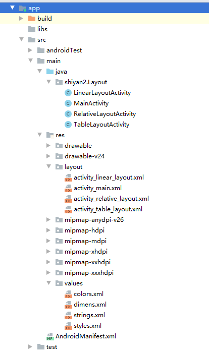
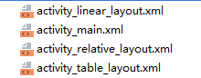
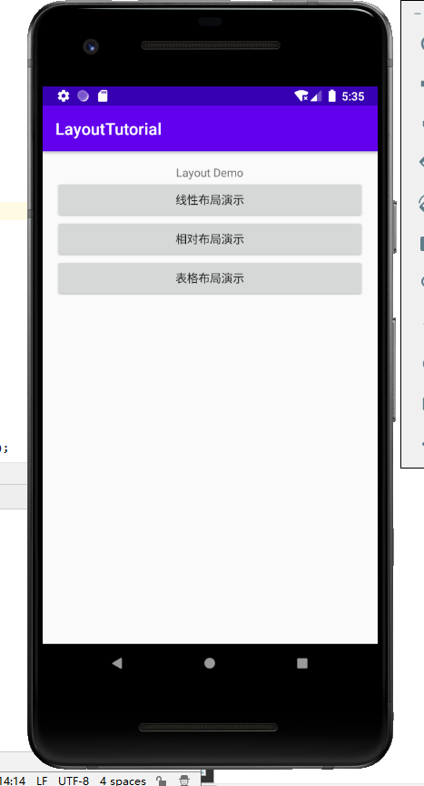
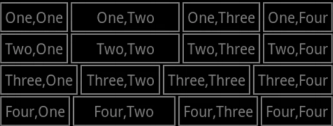
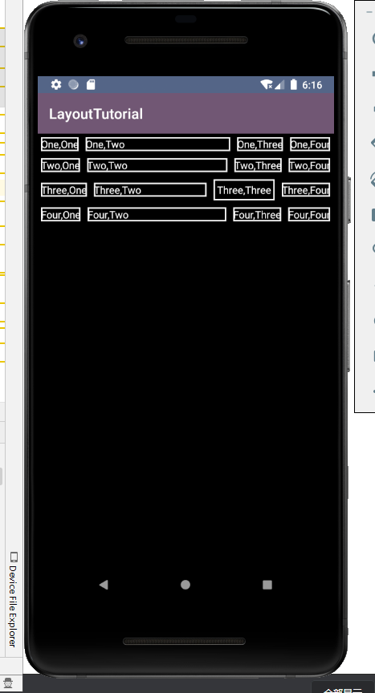
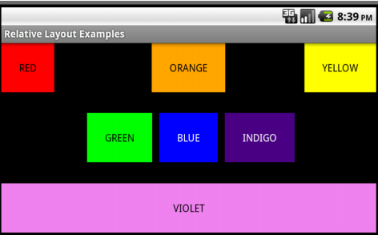
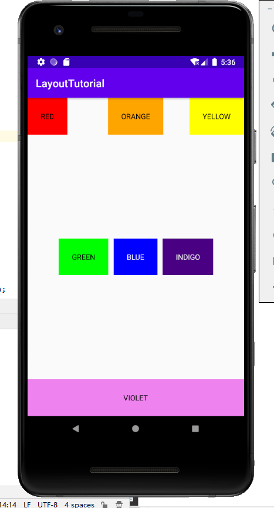
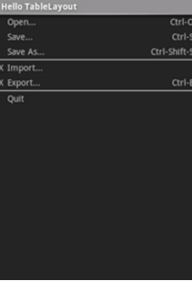
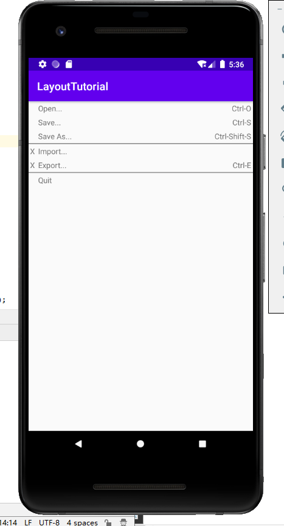

# Android界面布局实验

## 一、目录结构：

> 

- MainActivity.java：

> 定义了三处按钮和Intent组件来与三个布局activity进行交互与通讯

- LinearlayoutActivity.java:

> 在onCreat（）方法中启动LinearlayoutActivity，setContentView把指定的xml文件加载到activity中。

- RelativeLayoutActivity.java，TableLayoutActivity.java同上

- 在四个xml文件中定义布局

- AndroidManifest.xml：

> 指定APP的包名，进程名，决定了进程与组件的引用关系

- res中的values：

> 定义数组，颜色，字符串，主题风格

- drawable：

> 定义抽象化的对象

## 二、实现主页面跳转

## 三、线性布局实践：

- `利用线性布局实现如下界面：`

  

- `运行截图：`

## 四、ConstraintLayout实践

- `利用ConstraintLayout实现如下界面：`

- `运行截图：`

## 五、表格布局实践

- `利用表格布局实现如下界面：`

- `实验截图：`

