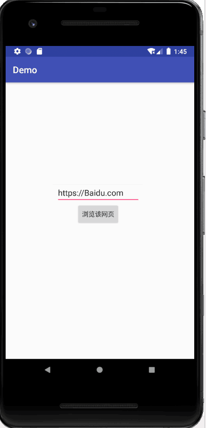
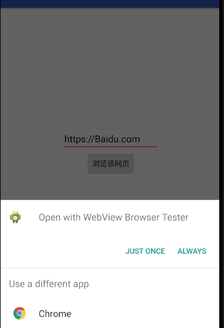
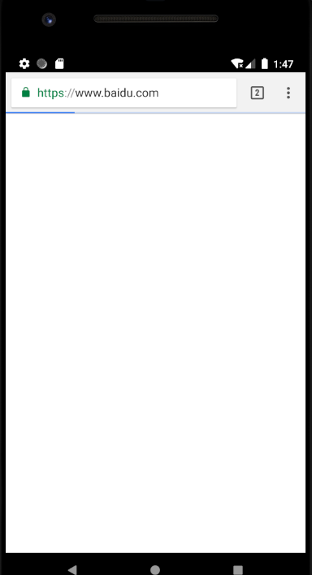
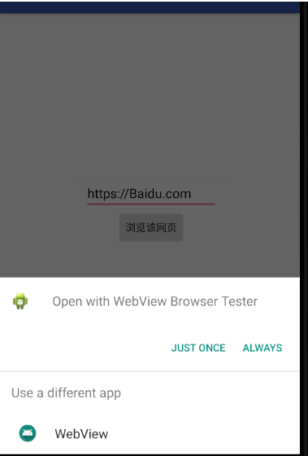
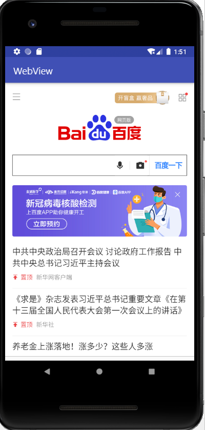

# 自定义WebView验证隐式Intent的使用

### 1.获取URL地址并启动隐式Intent的调用：


> 


主界面xml关键代码段：

```
<?xml version="1.0" encoding="utf-8"?>
<LinearLayout xmlns:android="http://schemas.android.com/apk/res/android"
    android:orientation="vertical"
    android:layout_width="match_parent"
    android:layout_height="match_parent"
    android:gravity="center_horizontal">
    <EditText
        android:layout_width="wrap_content"
        android:layout_height="wrap_content"
        android:id="@+id/edit_url"
        android:hint="@string/edit_url_hint"/>
    <Button
        android:layout_width="wrap_content"
        android:layout_height="wrap_content"
        android:id="@+id/btn_browse"
        android:text="@string/btn_browse"/>

</LinearLayout>


```


键入网址、点击按钮选择Chrome跳转







## 二：自定义WebView来加载URL








#### 创建xml文件


```
<?xml version="1.0" encoding="utf-8"?>
<RelativeLayout xmlns:android="http://schemas.android.com/apk/res/android"
    xmlns:tools="http://schemas.android.com/tools"
    android:layout_width="match_parent"
    android:layout_height="match_parent"
    android:paddingBottom="@dimen/activity_vertical_margin"
    android:paddingLeft="@dimen/activity_horizontal_margin"
    android:paddingRight="@dimen/activity_horizontal_margin"
    android:paddingTop="@dimen/activity_vertical_margin"
    tools:context="shiyan4.WebViewTest.WebViewTest">

    <WebView
        android:layout_width="match_parent"
        android:layout_height="match_parent"
        android:id="@+id/webView">
    </WebView>
</RelativeLayout>

```

#### WebViewTest.java

```

public class WebViewTest extends AppCompatActivity {

    @Override
    protected void onCreate(Bundle savedInstanceState) {
        super.onCreate(savedInstanceState);
        setContentView(R.layout.activity_my_webview);

        Intent intent = getIntent();

        Uri data = intent.getData();
        URL url = null;

        try {
            url = new URL(data.getScheme(), data.getHost(),
                    data.getPath());
        } catch (Exception e) {
            e.printStackTrace();
        }

        startBrowser(url);
    }

    private void startBrowser(URL url) {
        android.webkit.WebView webView = (android.webkit.WebView) findViewById(R.id.webView);
        webView.loadUrl(url.toString());
        webView.setWebViewClient(new WebViewClient(){
            @Override
            public boolean shouldOverrideUrlLoading(android.webkit.WebView view, String url) {
                // TODO Auto-generated method stub
                
                view.loadUrl(url);
                return true;
            }
        });
    }
}

```


